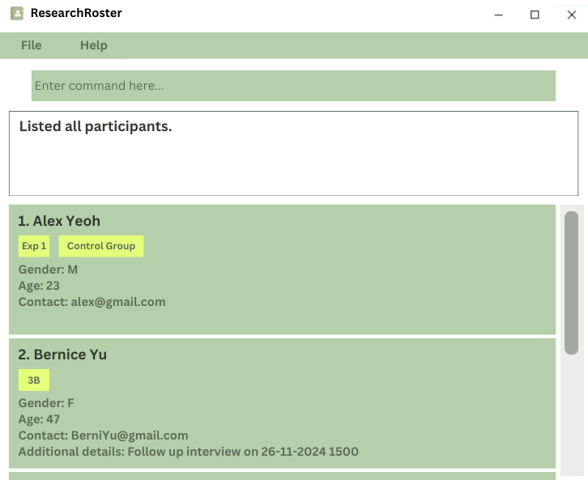

# ResearchRoster
ResearchRoster is a desktop application designed for researchers managing large groups of study participants. ResearchRoster allows for all participants' details to be consolidated and kept track of in a single program. It is optimized for research studies as it allows researches to efficiently consolidate contacts based on specific experimental criteria, and export it to an easy-to-read format for better data organization.

## Features
- [ ] Add participant contact with relevant details (name, gender, age, contact, research group)
- [ ] Delete participant contact
- [ ] View a list of all participant contacts
- [ ] Save participant contacts
- [ ] Exit the application

## Additional Information
* The project simulates an ongoing software project for a desktop application used for managing contact details.
* It is written in OOP fashion. It provides a reasonably well-written code base bigger (around 6 KLoC) than what students usually write in beginner-level SE modules, without being overwhelmingly big.
  * It comes with a reasonable level of user and developer documentation.
* It is named AddressBook Level 3 (AB3 for short) because it was initially created as a part of a series of AddressBook projects (Level 1, Level 2, Level 3 ...).
* For the detailed documentation of this project, see the [Address Book Product Website](https://se-education.org/addressbook-level3).
* This project is a part of the se-education.org initiative. If you would like to contribute code to this project, see [se-education.org](https://se-education.org/#contributing-to-se-edu) for more info.
* This project is based on the AddressBook-Level3 project created by the [SE-EDU initiative](https://se-education.org).
